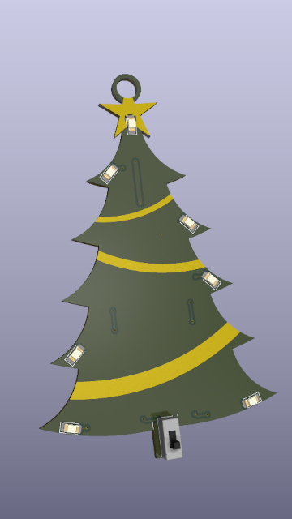

# Christmas Tree PCB

> 'Tis the Season for Makers

<!-- TODO: This text -->

This

|  |  |
| ---------------------------- | -------------------------------- |

## Instructions

<!-- TODO: This text -->

To make your own christmas Tree PCB, you will need the following components
To make your own Christmas Tree PCB

For a total sum of $3.17, excluding the PCB production cost.

| Part                                   | Description           | Amount | Est. Unit Cost (US) | Buy                                                                                                |
| -------------------------------------- | --------------------- | ------ | ------------------- | -------------------------------------------------------------------------------------------------- |
| MPD (Memory Protection Devices) BK-912 | Battery Retainer      | 1      | $0.49               | [DigiKey](https://www.digikey.com/en/products/detail/mpd-memory-protection-devices/BK-912/2647825) |
| Würth Elektronik 150120YS75000         | 1206 SMD LED (Yellow) | 1      | $0.2                | [DigiKey](https://www.digikey.com/en/products/detail/w%C3%BCrth-elektronik/150120YS75000/4489948)  |
| Würth Elektronik 150120BS75000         | 1206 SMD LED (Blue)   | 2      | $0.2                | [DigiKey](https://www.digikey.com/en/products/detail/w%C3%BCrth-elektronik/150120BS75000/4489933)  |
| Würth Elektronik 150120SS75000         | 1206 SMD LED (Red)    | 2      | $0.2                | [DigiKey](https://www.digikey.com/en/products/detail/w%C3%BCrth-elektronik/150120SS75000/4489942)  |
| Würth Elektronik 150120AS75000         | 1206 SMD LED (Amber)  | 2      | $0.2                | [DigiKey](https://www.digikey.com/en/products/detail/w%C3%BCrth-elektronik/150120AS75000/4489930)  |
| YAGEO RC1206FR-071KL                   | 1k SMD resistor       | 7      | $0.10               | [DigiKey](https://www.digikey.com/en/products/detail/yageo/RC1206FR-071KL/728387)                  |
| SS12D00G                               | SS12D00G Switch       | 1      | $0.08               | [AliExpress](https://www.aliexpress.com/item/4001207529493.html)                                   |
| Microchip Technology ATTINY202-SSFR    | ATtiny202-SS MCU      | 1      | $0.50               | [DigiKey](https://www.digikey.com/en/products/detail/microchip-technology/ATTINY202-SSFR/9554943)  |

A complete instruction guide is available in [`how-to.md`](how-to.md).

## License

This project is distributed under a [CERN-OHL-P-2.0](LICENSE) license.

## Acknowledgments

Thanks to @nadarbreicq for helping me choose the right family of ATtiny for my project needs.
Both Barbatronic and Heliox made good videos for anyone starting projects with ATtiny microcontrollers:

* @nadarbreicq - _Create flexible circuits with a vinyl cutter to make robots!_: https://youtu.be/GuyE88zjXyU
* @HelioxLab - _Program microcontrollers for your circuit boards! (ATtiny)_: https://youtu.be/KPtmi16cyaA

This project has been realized with the following stack of Free Open-Source Software. Thanks to the maintainers and contributors of these software tools:

* [FreeCAD](https://www.freecad.org) for the outline
* [Inkscape](https://inkscape.org) for the decoration and the art on the PCB
* [KiCAD](https://www.kicad.org) for the PCB design
* [PlatformIO](https://platformio.org) for programming
