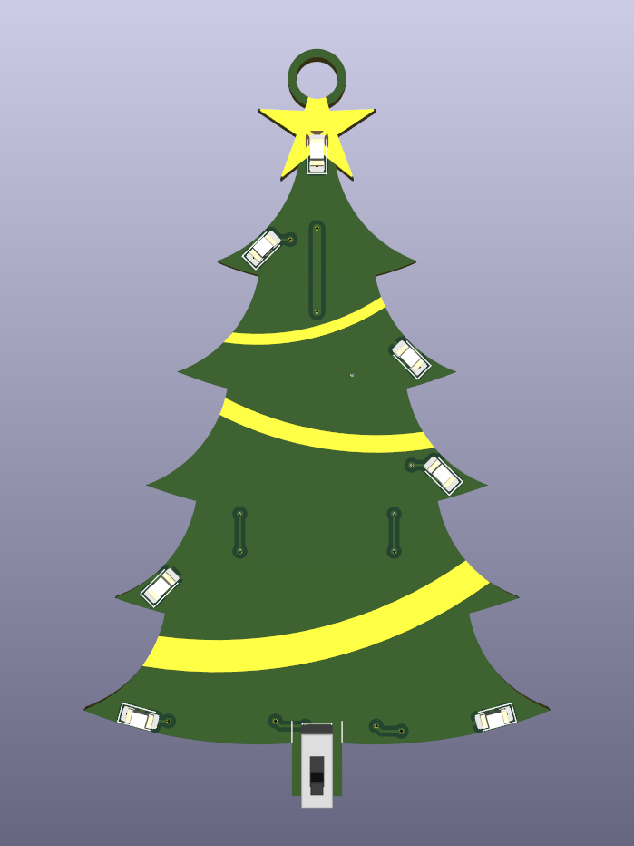
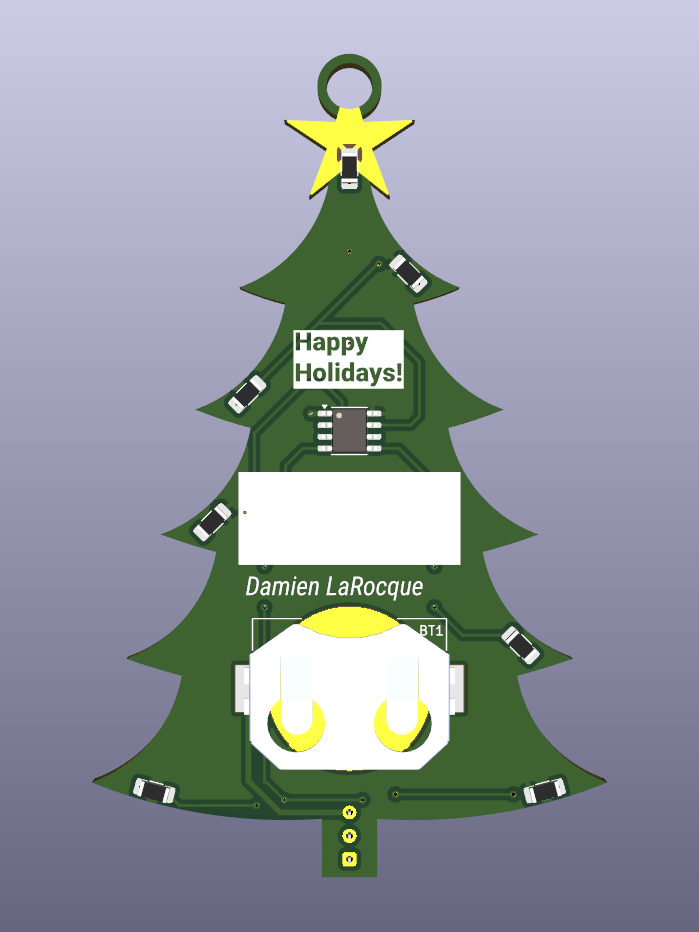

# Christmas Tree PCB How To

Here are the instructions on how to make your own Christmas tree PCB, divided in three sections:

- [Microcontroller Programming](#microcontroller-programming)
- [PCB Shape and Art](#pcb-shape-and-art)
- [PCB Design and Assembly](#pcb-design-and-assembly)

## Microcontroller Programming

This PCB uses a ATtiny202-SS microcontroller. I chose this family of ATtiny, for [its pinout](http://ww1.microchip.com/downloads/en/DeviceDoc/ATtiny202-402-AVR-MCU-with-Core-Independent-Peripherals_and-picoPower-40001969A.pdf#_OPENTOPIC_TOC_PROCESSING_d114e12593), because I wanted to have 3 PWM signals to blink the LEDs, as shown in the [schematic](pcb/output/schematics.pdf).
Also, with its operating supply voltage of [1.8-5.5 V](http://ww1.microchip.com/downloads/en/DeviceDoc/ATtiny202-402-AVR-MCU-with-Core-Independent-Peripherals_and-picoPower-40001969A.pdf#_OPENTOPIC_TOC_PROCESSING_d114e81594), it can be powered with a Lithium coin cell battery.

The PCB was not designed with reprogrammability in mind.
Hence, the ATtiny microcontrollers must be programed before assembly.

### Circuit to flash the ATTiny MCU

The ATtiny202-SS microcontroller is programmed using the UPDI interface.
You can use a Serial UPDI Programmer like [this one](https://github.com/wagiminator/AVR-Programmer/tree/master/SerialUPDI_Programmer) from @wagiminator.
Otherwise, you can also build the following circuit on a breadboard ([Source](https://github.com/microchip-pic-avr-tools/pymcuprog?tab=readme-ov-file#serial-port-updi-pyupdi)):

```
                        Vcc                     Vcc
                        +-+                     +-+
                         |                       |
 +---------------------+ |                       | +--------------------+
 | Serial port         +-+                       +-+  AVR device        |
 |                     |      +----------+         |                    |
 |                  TX +------+   1k     +---------+ UPDI               |
 |                     |      +----------+    |    |                    |
 |                     |                      |    |                    |
 |                  RX +----------------------+    |                    |
 |                     |                           |                    |
 |                     +--+                     +--+                    |
 +---------------------+  |                     |  +--------------------+
                         +-+                   +-+
                         GND                   GND
```

To connect my circuit to a USB port, I used a [FT232RL USB to TTL](https://www.amazon.ca/dp/B01JG8H5U4) Serial Adapter Module set with a logic level voltage of 3.3 V.
One can also use an adapter like [this breakout](https://www.sparkfun.com/products/9873) from Sparkfun or [this console cable](https://www.adafruit.com/product/954) from Adafruit, as long as the serial port logic level is at 3.3V.

### Software tools to flash the MCU

The PlatformIO project in [`firmware`](firmware) uses [`pymcuprog`](https://github.com/microchip-pic-avr-tools/pymcuprog) to program the ATTINY202-SSFR, as shown in the [`platformio.ini`](firmware/platformio.ini#L28) file.
You can install `pymcuprog` using pip:

```sh
pip install pymcuprog
```

To test that your ATTiny will be flashed correctly with `pymcuprog`, you can ping it with:

```console
pymcuprog ping -d attiny202 -t uart -u /dev/<device-port>
```

You can also read some bytes from the flash memory space with this command, where we read `64` bytes from a offset `0x100`

```console
pymcuprog read -m flash -o 0x0100 -b 64 -d attiny202 -t uart -u /dev/<device-port>
```

### Programming verification

You can verify that the MCU is properly programmed by adding the LED circuit of [the schematic](pcb/output/schematics.pdf) to your programming breadboard.

## PCB Shape and Art

To give a Christmas tree look to the PCB, a tree shape must be drawn on the Edge Cuts layer.
Also, the front solder mask was used to include decorative elements, aka a golden star and garlands.

### PCB Edge Cut

In the original version of the project, the edge cut of the PCB was originally designed in 2023 with RealThunder's [FreeCAD Link Branch](https://github.com/realthunder/FreeCAD), using the [KicadStepUp Workbench](https://wiki.freecad.org/KicadStepUp_Workbench).
The file [`christmas-tree-pcb.FCStd`](mcad/christmas-tree-pcb.FCStd) of this repo, contains a copy of the PCB sketch, made with [FreeCAD 1.0](https://wiki.freecad.org/Release_notes_1.0).


### Solder Mask

The golden star and garlands are drawn using the front copper layer and a solder mask.
While the outline of the garlands was [drawn on the front solder mask](mcad/front-mask.svg) with KiCad, they were [filled](mcad/garlands.svg) using Inkscape.

| Front Mask                   | Garlands                      |
| ---------------------------- | ----------------------------- |
|  |  |

## PCB Design and Assembly

The [PCB](pcb/) has been designed with KiCad 8.0.7.
All components files are available in the KiCad component libraries or in the project libraries in [`pcb/lib/`](pcb/lib).

| Front                    | Back                   |
| ------------------------ | ---------------------- |
|  |  |

### Printing or ordering the PCB

You can print the PCB by yourself or you can order it from a fab house.
For the best results when ordering, I recommend:

* choosing a ENIG surface finish to have golden garlands and star
* if applicable, hide the order number. If not hidden, this order number will be most probably written on the front of the PCB, as the front surface is mostly empty.

### Bill of materials

The table belows shows the components that are required to make your own Christmas tree PCB.
This BOM is also available [in CSV](pcb/output/bom.csv).
Excluding the PCB production, the total estimated cost for one tree is around $3.17 (US).

| Part                                   | Description           | Amount | Est. Unit Cost (US) | Buy                                                                                                |
| -------------------------------------- | --------------------- | ------ | ------------------- | -------------------------------------------------------------------------------------------------- |
| MPD (Memory Protection Devices) BK-912 | Battery Retainer      | 1      | $0.49               | [DigiKey](https://www.digikey.com/en/products/detail/mpd-memory-protection-devices/BK-912/2647825) |
| Würth Elektronik 150120YS75000         | 1206 SMD LED (Yellow) | 1      | $0.20               | [DigiKey](https://www.digikey.com/en/products/detail/w%C3%BCrth-elektronik/150120YS75000/4489948)  |
| Würth Elektronik 150120BS75000         | 1206 SMD LED (Blue)   | 2      | $0.20               | [DigiKey](https://www.digikey.com/en/products/detail/w%C3%BCrth-elektronik/150120BS75000/4489933)  |
| Würth Elektronik 150120SS75000         | 1206 SMD LED (Red)    | 2      | $0.20               | [DigiKey](https://www.digikey.com/en/products/detail/w%C3%BCrth-elektronik/150120SS75000/4489942)  |
| Würth Elektronik 150120AS75000         | 1206 SMD LED (Amber)  | 2      | $0.20               | [DigiKey](https://www.digikey.com/en/products/detail/w%C3%BCrth-elektronik/150120AS75000/4489930)  |
| YAGEO RC1206FR-071KL                   | 1k SMD resistor       | 7      | $0.10               | [DigiKey](https://www.digikey.com/en/products/detail/yageo/RC1206FR-071KL/728387)                  |
| SS12D00G                               | SS12D00G Switch       | 1      | $0.08               | [AliExpress](https://www.aliexpress.com/item/4001207529493.html)                                   |
| Microchip Technology ATTINY202-SSFR    | ATtiny202-SS MCU      | 1      | $0.50               | [DigiKey](https://www.digikey.com/en/products/detail/microchip-technology/ATTINY202-SSFR/9554943)  |

### Assembly

While soldering the PCB, you can use the [interactive BOM](pcb/output/ibom.html) to check off your progress.

The PCB was designed to be easily soldered by hand, as I took this project as an opportunity to learn how to solder SMD components by hand.
Hence why all resistors and LEDs are 1206 (3216 Metric).
If you never soldered SMDs before, a good practice is to start with small components.
Hence, for this PCB, I would recommend soldering the components in the following order:

* Start with either the LEDs or the resistors
* Continue with the resistors or the LEDs on the other side.
* Solder the ATtiny.
  * This component turned out to be the hardest to solder. Luckily there are plenty of tutorials on YouTube on how to solder SOIC components.
  * Once soldered, I tested the continuity to ensure that each lead is properly soldered to his corresponding pad. You can use the PCB [schematic](pcb/output/schematics.pdf) and layout files to determine where to probe for continuity.
* Solder the coin cell battery retainer.
  * Put a blob of solder on each small side pad.
  * Then, for each pad, insert a flap of the retainer while keeping the iron on the blob.
  * You can then adjust the position of the retainer by iteratively moving it while melting the solder on a pad. Once the retainer is well placed, add more solder above each flap so that you're sure that it won't easily break out.
* Finally, solder the through-hole switch. Once soldered, I recommend using a wire cutter to cut the tips of the leads (don't forget the protective eyewear !).

## A final touch-up

To hang the PCB in a tree, you can pass a satin ribbon through the top hole.
As the hole has a diameter of 5 mm, a 3 mm (1/8 inch) wide ribbon does the job.

## Sources

* [ATtiny202-SS datasheet](http://ww1.microchip.com/downloads/en/DeviceDoc/ATtiny202-402-AVR-MCU-with-Core-Independent-Peripherals_and-picoPower-40001969A.pdf)
* **Programming with UPDI:**
  * [JTAG2UPDI and SerialUPDI](https://teddywarner.org/Projects/SerialUPDI)
  * [SerialUPDI Programmer](https://github.com/wagiminator/AVR-Programmer/tree/master/SerialUPDI_Programmer)

